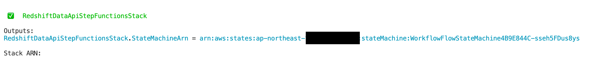
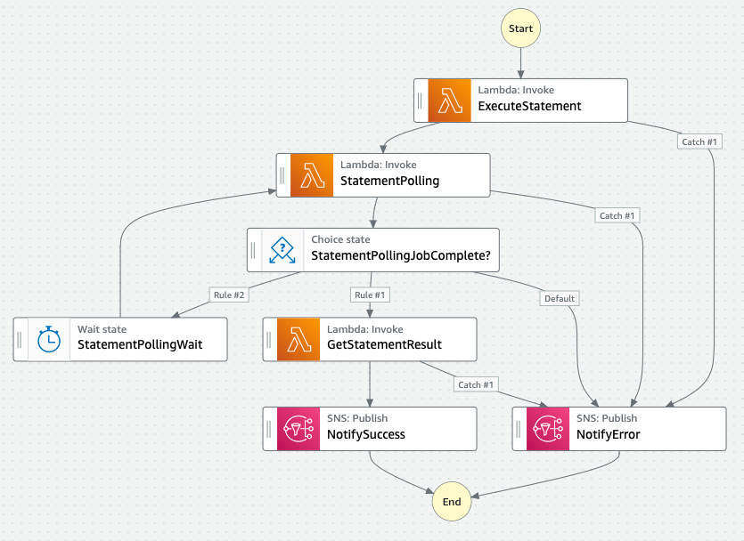

# Redshift Data API with Step Functions sample
[](https://github.com/aws-samples/redshift-data-api-with-step-functions-sample/actions/workflows/build.yml)

This is a sample Step Functions CDK Construct for Redshift Data API, which executes a SQL statement, poll the status for the execution, and get resulting records from the statement.

## Overview
You can execute a SQL statement to RedShift using [Redshift Data API](https://docs.aws.amazon.com/redshift/latest/mgmt/data-api.html).

Data API returns its result asynchronously, which means you must poll the result for an exectuion.
The detailed processes you might need to implement are the following:

1. Call [ExecuteStatement API](https://docs.aws.amazon.com/redshift-data/latest/APIReference/API_ExecuteStatement.html): you get a statement ID for the execution.
2. Call [DescribeStatement API](https://docs.aws.amazon.com/redshift-data/latest/APIReference/API_DescribeStatement.html): you can query the state of the exectuion using the statement ID. You must call this API periodically to check if the statement is finished.
3. Call [GetStatementResult API](https://docs.aws.amazon.com/redshift-data/latest/APIReference/API_GetStatementResult.html) (optional): if you need the records returned by the statement, you can call this API.

Although you may think you can do the above process in a single Lambda function, it's not always desirable. It's because there is 15 minutes limit for the execution time, and it would not be very cost-efficient for a Lambda instance just to wait until an execution finishes.

In this sample, we use Step Functions for the process, orchestrating multiple Lambda functions to execute, poll, and fetch the results from a statement. The detail is covered in [How it works](#how-it-works) section.

In the following sections, we'll explain how you can deploy and use them first.

**NOTE**: This sample's architecture is for demonstration purpose only. You can use it in your production environment at your own risk.

## Deploy
Before deploying this sample, you must install AWS Cloud Development Kit prerequisites. [Please refer to this document](https://docs.aws.amazon.com/cdk/latest/guide/getting_started.html) for the detailed instruction. Make sure you've successfully completed `cdk bootstrap` step.

After that, clone this repository and `cd` to its root directory.

You must first install Node.js dependencies for CDK code by the following commands:

```sh
npm ci
```

Now you can deploy this sample's stack by the following command:

```sh
npx cdk deploy --require-approval never
```

Initial deployment usually takes about 5 minutes.

After a successful deployment, you can check the ARN for Step Functions statemachine.


## Usage
To see how the state machine works, you can execute it with the following AWS CLI command:

```sh
aws stepfunctions start-execution --state-machine-arn STATE_MACHINE_ARN
```

Please replace `STATE_MACHINE_ARN` with the actual ARN you can see when you deployed the CDK stack.

You can check [Step Functions Console](https://console.aws.amazon.com/states/home) for execution log and [CloudWatch Logs console](https://console.aws.amazon.com/cloudwatch/) for Lambda logs.

## How it works
Below image is a diagram for our Step Functions construct.



First, it calls ExecuteStatement API in a Lambda function. This step returns a statement ID for the execution, which is later referenced in other states.

In the next state, it calls DescribeStatement API in a Lambda to get the execution status.
The next `Choice` state checks if the execution is finished. If it's not finished, it will call DescribeStatement again after a moment. If it finds the execution failed, it notifies error to Amazon SNS.

If the execution is successfully finished, it will call GetStatementResult API to get records from the statement, finally notifying success to Amazon SNS.

## Clean up
To avoid incurring future charges, clean up the resources you created.

You can remove all the AWS resources deployed by this sample running the following command:

```sh
npx cdk destroy --force
```

## Security
See [CONTRIBUTING](CONTRIBUTING.md#security-issue-notifications) for more information.

## License
This library is licensed under the MIT-0 License. See the LICENSE file.
